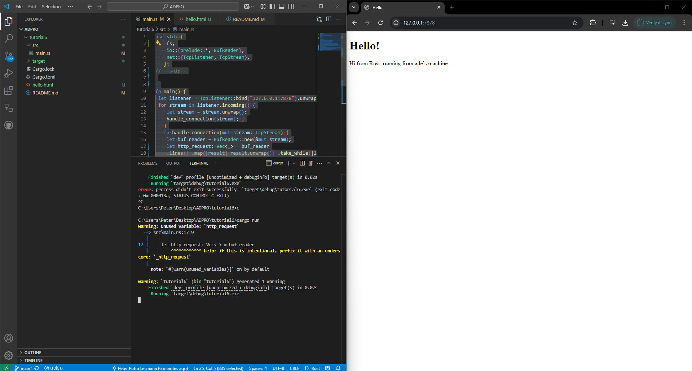
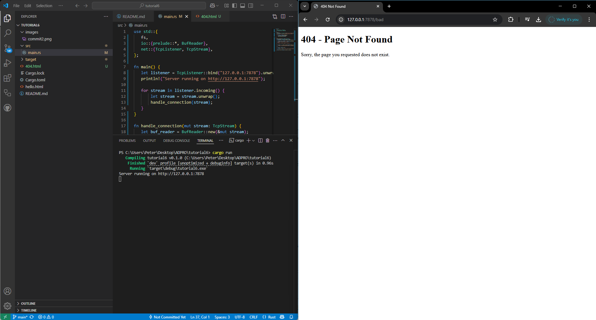

# tutorial6


# Dokumentasi `handle_connection` dalam Rust

## Fungsi `handle_connection`

Fungsi `handle_connection` bertanggung jawab untuk menangani koneksi masuk dari klien yang terhubung ke server TCP. Fungsi ini membaca permintaan HTTP yang dikirim oleh klien dan mencetaknya ke terminal.

### Implementasi Fungsi

```rust
fn handle_connection(mut stream: TcpStream) {
    let buf_reader = BufReader::new(&mut stream);
    let http_request: Vec<_> = buf_reader
        .lines()
        .map(|result| result.unwrap())
        .take_while(|line| !line.is_empty())
        .collect();
    
    println!("Request: {:#?}", http_request);
}
```


# Commit 2
## Screenshot




# Commit 3 Reflection Notes

##  **Kode Program Setelah Refactoring**
Kode telah diperbaiki dengan memisahkan tanggung jawab **membangun respons HTTP** dalam fungsi terpisah, sehingga lebih rapi dan mudah dikelola.

```rust
use std::{
    fs,
    io::{prelude::*, BufReader},
    net::{TcpListener, TcpStream},
};

fn main() {
    let listener = TcpListener::bind("127.0.0.1:7878").unwrap();
    println!("Server berjalan di http://127.0.0.1:7878");

    for stream in listener.incoming() {
        let stream = stream.unwrap();
        handle_connection(stream);
    }
}

// Fungsi utama untuk menangani koneksi HTTP
fn handle_connection(mut stream: TcpStream) {
    let buf_reader = BufReader::new(&mut stream);
    let request_line = buf_reader.lines().next().unwrap().unwrap();

    let (status_line, filename) = if request_line.contains("GET / ") {
        ("HTTP/1.1 200 OK", "hello.html")
    } else {
        ("HTTP/1.1 404 NOT FOUND", "404.html")
    };

    let response = build_response(status_line, filename);
    stream.write_all(response.as_bytes()).unwrap();
}

// Fungsi untuk membangun respons HTTP
fn build_response(status_line: &str, filename: &str) -> String {
    let contents = fs::read_to_string(filename).unwrap_or_else(|_| {
        "<h1>404 - Halaman Tidak Ditemukan</h1><p>Silakan periksa kembali URL yang Anda masukkan.</p>".to_string()
    });

    let length = contents.len();
    format!("{status_line}\r\nContent-Length: {length}\r\n\r\n{contents}")
}

```
##  **Mengapa Perlu Refactoring?**
Refactoring dilakukan untuk **memisahkan tanggung jawab fungsi** agar kode lebih mudah dibaca dan dipelihara. Berikut adalah alasan utama mengapa refactoring diperlukan:

###  **1. Modularitas**
- Dengan **memisahkan fungsi `build_response()`**, kode menjadi lebih **terstruktur** dan **mudah dikembangkan**.
- Jika ingin menambahkan fitur baru, kita hanya perlu memperbarui fungsi yang relevan **tanpa mengubah keseluruhan kode**.

### **2. Pemeliharaan yang Lebih Mudah**
- Jika ada perubahan pada **format respons HTTP**, kita hanya perlu **mengedit satu fungsi**, yaitu `build_response()`, tanpa menyentuh `handle_connection()`.
- Dengan cara ini, **pemeliharaan kode lebih mudah** dan mengurangi risiko kesalahan.

### **3. Menghindari Duplikasi Kode**
- Tanpa refactoring, kita harus menulis ulang format respons di beberapa tempat.
- Dengan **memisahkan logika respons ke dalam fungsi `build_response()`**, kita **menghindari pengulangan kode** dan **menjaga efisiensi**.

